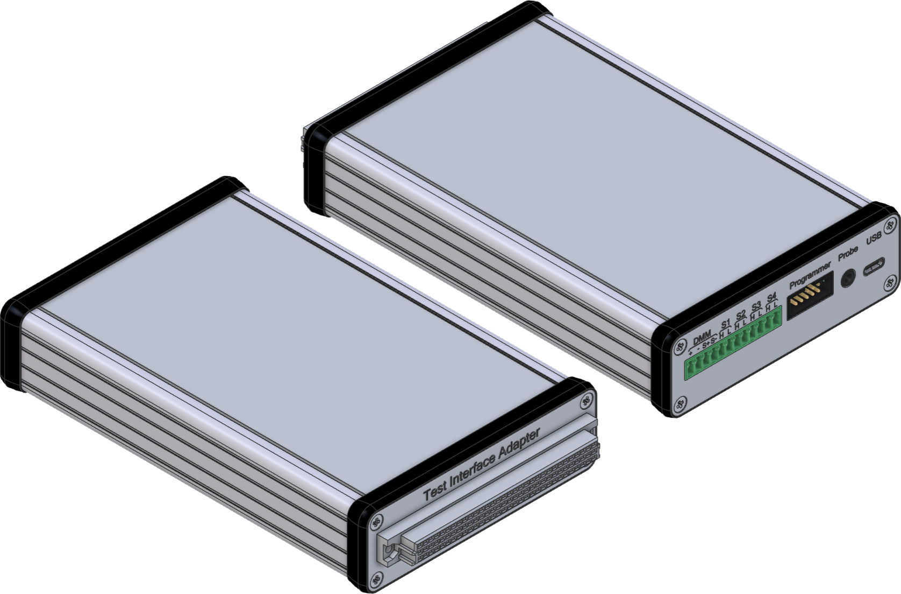

# Work in progress

# *compact* Test Interface Adapter

The *compact* Test Interface Adapter is designed for low-volume in-circuit testing applications where an all-in-one ATE system would be overkill.  
Instead of expensive integrated solutions, this approach leverages standard external instruments, such as a digital multimeter with some type of remote control interface like USB, RS232, Ethernet, or GPIB to take various measurements from the DUT (Device Under Test).  
Various external stimulus sources like power supplies or function generators can also be switched to the DUT through the adapter.

### Features:

- **32-channel relay matrix**
- **16-channel relay switches**
- **4 external stimulus inputs**, via 2A capable relays
- **Programmer passthrough port** for in-circuit programming applications
- **External probe input**, routable to matrix channel 1
- **Isolated half-duplex RS485 interface**
- **Isolated UART interface**
- **Isolated I²C interface**

### Docs:

- [Schematic](docs/schematic.pdf)

